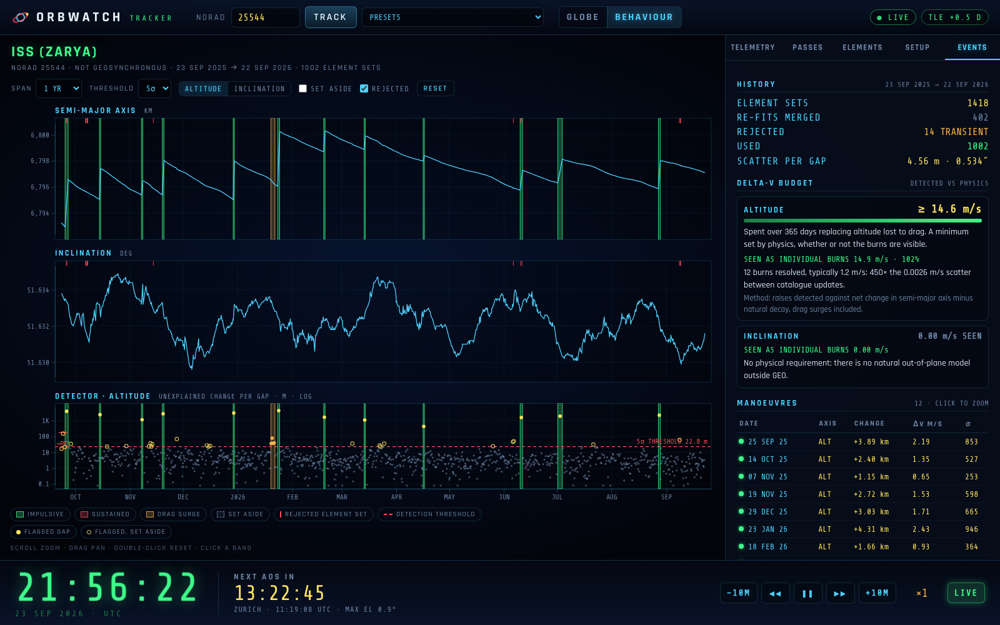
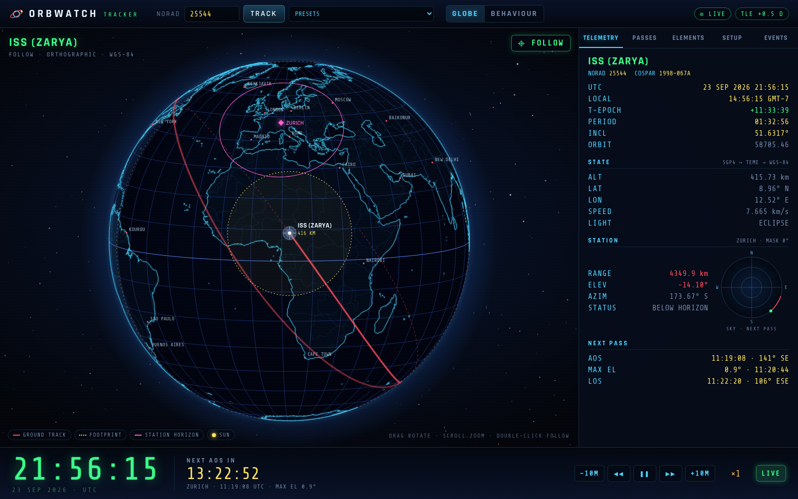
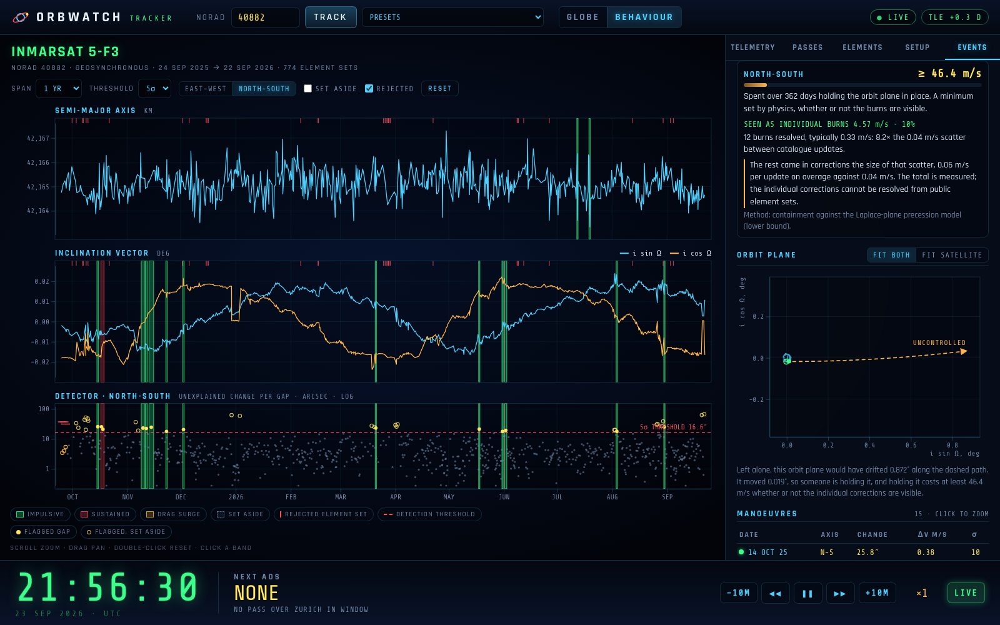

# ORBWATCH

Satellite tracking and manoeuvre detection from public orbital data, in Python.

ORBWATCH reconstructs a year of an object's orbit from its public element sets,
finds when it manoeuvred, estimates the propellant that took, and states what
the data cannot resolve. It then plans a mission to go and inspect it: the
transfer from a rideshare drop-off, and a delta-v and propellant budget with
margins.



## What it does

**Catalogue and propagation**
- Element sets from Celestrak (current) and Space-Track (history), cached and
  rate-limited
- SGP4 propagation; TEME, Earth-fixed and WGS-84 geodetic frames, checked
  against astropy
- Ground station look angles, lighting and pass prediction

**Manoeuvre detection**
- Cleans a history: merges re-fits of the same epoch and rejects transient bad
  fits with a two-sided test
- Flags, gap by gap between catalogue updates, any change the object's recent
  natural motion does not explain: in plane from the semi-major axis, out of
  plane from the inclination, or the inclination vector at GEO
- Separates burns from fit noise, from jumps that undo themselves, and from
  drag surges caused by space weather

**Delta-v budgets**
- Checks detected burns against what physics requires: drag make-up in low
  orbit, and at GEO the propellant needed to hold the orbit plane against its
  natural precession
- A satellite's station-keeping is therefore measured even when its individual
  corrections are too small to resolve

**Pattern of life**
- Estimates a geostationary operator's east-west station-keeping from its own
  history: the longitude box, where it burns, how often and how hard, and the
  drift acceleration against the J22 model
- Forecasts the next burn two ways, from the cadence and from the physics of
  the drift, scores both walk-forward on held-out burns, and uses the one with
  the better record

**Mission design**
- Plans a rendezvous from a rideshare drop-off to a catalogued target: Hohmann
  transfers with optimally split plane changes, a Lambert solver for the
  far-range approach, and J2 drift orbits that line up the orbit planes for
  free, traded against time
- Builds the delta-v budget with ESA assessment-study margins and sizes the
  propellant

**Tracker**
- A local browser interface with three views of the selected object: a live
  globe with ground track, footprint, station horizon and passes; its
  behaviour, with history, manoeuvres, budgets and pattern of life; and a
  mission plan to reach it, where the time budget, the drop-off and the
  spacecraft can be changed and the time against delta-v trade updates live.
  Every number comes from the tested Python modules; the browser only draws.

<p>
  
  
</p>

## Validation

One year of history to September 2026, at the default five-sigma threshold.

| Object | Check | Result |
|---|---|---|
| ISS | 10 reboosts announced by NASA | 10 of 10 detected; the two published raise sizes matched within 4%; burns account for the drag make-up to within 2% |
| NOAA 20 | Drag make-up | 3 burns, budget closes at 100% |
| Hubble | No propulsion | No manoeuvres |
| ISS, Tiangong, Hubble | G4 geomagnetic storm, 19 January 2026 | The same drag surge on all three, reported as natural |
| INMARSAT 5-F3 | GEO north-south station-keeping | 46 m/s a year from holding the plane; about 10% resolved as individual burns, consistent with daily electric-propulsion firings |
| INTELSAT 905 | Inclination not held | Plane drifts as the model predicts, within 9%; 46 east-west burns, roughly weekly, all in the same direction |
| Lambert solver | Curtis, example 5.2 | Matched to the published four decimals |
| Sun-synchronous local time | Sentinel-2A, published 22:30 | 22:30 |
| INTELSAT 905 | Next-burn forecast, 18 held-out burns | Median error 1.4 days, the limit set by the operator's own variability in where it burns |

## Limits

- Element sets are mean elements fitted by the catalogue, not measurements.
  The detector sees what survives that fit.
- Corrections made more often than the catalogue updates show up as scatter,
  not as events. Their total is still measured by the budget.
- In low orbit, a low-thrust lowering looks like a drag surge.
- The pattern-of-life forecast needs discrete burns with free drift between
  them. A satellite steered continuously, as electric propulsion does, gets a
  verdict saying so instead of a forecast.
- The GEO drift model is a simplified Laplace-plane precession, good to about
  10% over a year.

## Quick start

```
python3 -m venv .venv
source .venv/bin/activate
pip install -e ".[dev]"
pytest -m "not network"
python -m orbwatch.gui
```

The tracker opens at http://127.0.0.1:8765. It binds to localhost and has no
authentication, so do not expose it on a network.

**Space-Track.** The behaviour view and the command line read histories from
Space-Track, which needs a free account. Put the credentials in `.env` in the
directory you run from; it is git-ignored.

```
SPACETRACK_USER=you@example.com
SPACETRACK_PASSWORD=...
```

Downloads are cached under `data/cache/spacetrack`, as Space-Track asks, and
requests are throttled well below its rate limits.

**Command line.** Manoeuvres, set-aside events and budgets for one object over
the last year, with an optional figure:

```
python -m orbwatch.events 25544 --plot iss.png
```

**Mission plan.** A rendezvous with ENVISAT from a 525 km sun-synchronous
rideshare, with the time against delta-v trade and the budget:

```
python -m orbwatch.transfer 27386 --dropoff-altitude 525 --max-days 180
```

## Layout

```
orbwatch/
  catalog/   element sets, Celestrak and Space-Track, SGP4, time scales, frames
  access/    lighting and pass prediction
  events/    history cleaning, manoeuvre detection, pattern of life, CLI
  transfer/  Kepler propagation, Lambert, manoeuvres, J2 drift, rendezvous plan
  budget/    delta-v and propellant budget with margins
  gui/       local web server and browser interface
tests/       unit tests; tests that need the internet are marked "network"
```

The astrodynamics is implemented here rather than imported, with one
exception: SGP4, which nobody should reimplement. Every function documents its
reference frame and units; internally the convention is km, km/s, radians and
seconds.

Next: proximity operations for the inspection mission.

## Licence

MIT. Map data is Natural Earth via world-atlas, drawn with D3; their licences
are in `orbwatch/gui/static/vendor/` and `orbwatch/gui/static/data/`.
