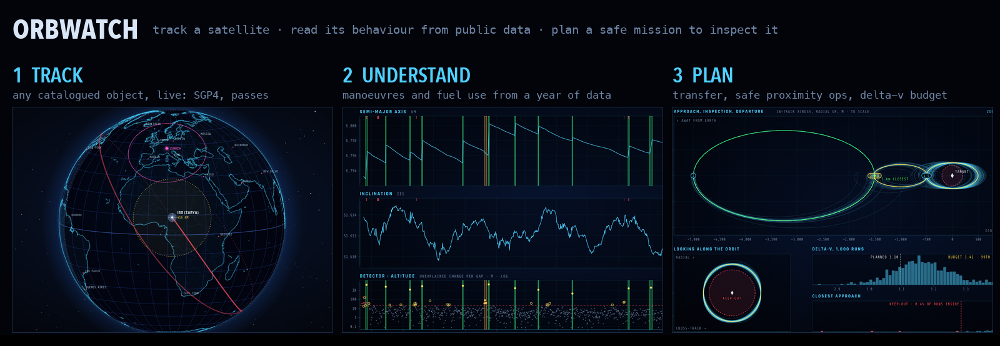

# ORBWATCH

**Track a satellite, read what it has been doing from public data and plan a safe mission to go and inspect it.** Open source, in Python.



## What it does

- **Track** any catalogued object: SGP4 propagation, ground track and passes over a station, live.
- **Understand** its behaviour from a year of public element sets: when it manoeuvred, the propellant that cost and when a geostationary operator will burn next.
- **Plan** a mission to inspect it: a J2-assisted transfer, passively safe proximity operations and a delta-v budget sized by Monte Carlo, with ESA margins.

It all runs in a local browser interface, and every number comes from tested Python.

## Checked against

- All 10 ISS reboosts NASA announced in a year are found, and they close the drag budget to within 2%.
- Hubble, which has no thrusters, shows no manoeuvres; a geomagnetic storm is reported as drag, not burns.
- Lambert, Hohmann and sun-synchronous local time match published values.
- Every burn of the ENVISAT inspection can fail without the spacecraft entering a 200 m keep-out sphere.

The full table and the known limits are in [docs/DETAILS.md](docs/DETAILS.md).

## Quick start

```
python3 -m venv .venv
source .venv/bin/activate
pip install -e ".[dev]"
python -m orbwatch.gui
```

The interface opens at http://127.0.0.1:8765. It is local only, with no authentication.

The behaviour view reads histories from [Space-Track](https://www.space-track.org), which needs a free account. Put the credentials in `.env`, which is git-ignored:

```
SPACETRACK_USER=you@example.com
SPACETRACK_PASSWORD=...
```

From the command line, the ISS's manoeuvres and budgets, then an inspection mission to ENVISAT:

```
python -m orbwatch.events 25544
python -m orbwatch.transfer 27386
```

Tests: `pytest -m "not network"`.

## Layout

```
orbwatch/
  catalog/   element sets, SGP4, time scales and frames
  access/    lighting and passes
  events/    manoeuvre detection, budgets, pattern of life
  transfer/  Lambert, Hohmann, J2 drift, rendezvous plan
  rpo/       Clohessy-Wiltshire, proximity design, Monte Carlo
  budget/    delta-v and propellant with margins
  gui/       local server and browser interface
```

## Licence

MIT. Map data is Natural Earth via world-atlas; licences are in `orbwatch/gui/static/`.
